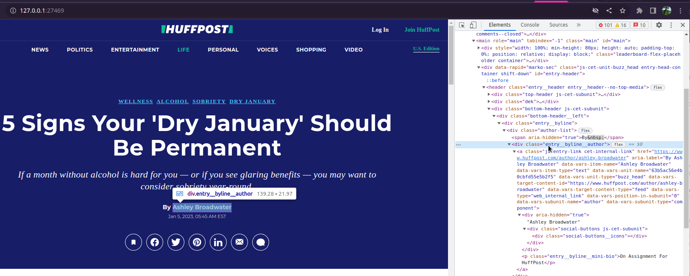

```{r, include = FALSE}
knitr::opts_chunk$set(
  collapse = TRUE,
  comment = "#>",
  eval = FALSE
)
```

This vignette shows you how to write your own parser for a new site.
Feel free to either use your parser locally or (preferably) contribute it back to the package via a [pull request](https://github.com/JBGruber/paperboy/pulls).

If you want to contribute, your first steps should be to check if the parser you are looking for is already available (you can use `pb_available()` for that), or if someone has already committed to working on it in [an issue](https://github.com/JBGruber/paperboy/issues) and if this is not the case, you should [open a new issue](https://github.com/JBGruber/paperboy/issues/new) to let others know you want to do it.

The next step is to get some test data, that means URLs from the page you want to scrape.
I like to use Media Cloud for that, which has an excellent R package we can employ here (the code below assumes you've already set `MEDIACLOUD_API_KEY`).
So let's walk through the process with huffpost.com as an example.
We first need the internal ID of the site on Media cloud and then ask for 500 articles dating back a week from today

```{r}
library(mediacloud)
search_media("huffpost")
test_data <- search_stories(title = "*",
                            media_id = 27502,
                            after_date = Sys.Date() - 7,
                            n = 500)
```

Next, you can collect the raw data of a few of these URLs to investigate the needed html identifiers:

```{r}
library(paperboy)
articles_raw <- pb_collect(test_data$url[1:20])
```

This pulls the entire sites of each article from the net.
If it doesn't, you probably need to set some cookies first (vignette on cookies coming soon).
In most cases, it does not make much sense though to look at the data with e.g., `View()`, since the html data is relativly big and the viewer might crash.
Instead, `paperboy` comes with a function to inspect the code in your browser:

```{r}
pb_inspect(articles_raw, 1L)
```



From here we want to identify at least the headline, article text, publication date and time, and the author(s).
Use the tools you are most comfortable with, I usually just right-click and `Inspect` in Chromium and then look for a suitable CSS tag.
To get better with tags, I recommend the cool game [CSS Diner](https://flukeout.github.io/).

Once you know roughly how the site publishes articles, you can start a new parser which pulls the relevant information from the html code.
The best way to start is from the built-in template using the un-exported function `pb_new()`.
Just enter the domain of the site (or an entire URL) to create the correct function (the new file will be placed in your working directory or the /R directory if you work in the package folder):

```{r}
paperboy:::pb_new(np = "http://huffpost.com/")
```

If you are familiar with `rvest`, you should have no problem making the parser work in minutes.
Feel free to look at the available parsers for inspiration.
To make the process even easier, `paperboy` adds the function `html_search` which can search through multiple CSS identifiers and node attributes at once.
As an example, have a look at the default parser, which is designed to grab data from many different sites:

```{r eval=FALSE}
html %>%
  html_search(selectors = c(
      "[property=\"sailthru.title\"]",
      "[property=\"og:title\"]",
      ".headline__title",
      ".headline__subtitle",
      ".js-headline",
      ".headline",
      ".pg-headline",
      ".headline>h1",
      ".headline__text",
      "[property =\"mol:headline\"]",
      "[id*=\"video-headline\"]",
      "title"
    ), attributes = c("content", "text"))
```

It looks through all the listed selectors and retrieves the attribute content or the text of the node if anything is found (note you can set `all = FALSE` to only collect the first non empty node).

The most difficult decision for most parsers is which CSS tags to choose.
There is usually a tradeoff between a more specific parser that provides clean data and a more general parser that causes fewer problems when it comes to maintaining different formats on the same website.
A good example is the text column, which you can produce almost always like this:

```{r}
text <- html  %>%
  rvest::html_elements("p") %>%
  rvest::html_text2() %>%
  paste(collapse = "\n")
```

This selects all paragraphs on a site, which often also includes irrelevant data, such as infos for subscribers, ads, readers' comments or even meta data that is usually hidden from view.
So it is usually better to do something like this instead:

```{r}
text <- html  %>%
  rvest::html_elements(".article-body>p") %>%
  rvest::html_text2() %>%
  paste(collapse = "\n")
```

This code will only select paragraphs from the article-body class, which works well for most washingtonpost.com articles, for example.
However, not all articles on the website have this class, for which case you want to create a fallback.
`html_search()` can do this like shown below:

```{r}
text <- html %>%
  html_search(selectors = c(".article-body>p", "p"), # select paragraphs in .article-body or just all paragraphs
              attributes = "text",                   # retrieve the text from selected nodes 
              all = FALSE,                           # only the first non-empty match is used
              n = Inf) %>%                           # default is to return the first attribute, we want all paragraphs
  paste(collapse = "\n")
```

Another notable helper function is `s_n_list` (for safe named list), which combines multiple R objects into a named list in which all elements have the length 1.
The returned value of `s_n_list` should be the output of all parsers:

```{r eval=TRUE}
a <- 1:10 # longer objects are put in a list
b <- NULL # NULL is turned into NA
c <- NA
paperboy:::s_n_list(a, b, c)
```

Combining the data in this way makes sure the data can be neatly placed in a tibble later.
You should still make sure though that the objects *headline*, *article*, *datetime*, and *author* have length 1 (with `toString()` and `head(x, 1L)` respectively).
You can also include additional fields in your parser if this makes sense in a specific case.
The huffpost, for example, also distributes videos, so the *type* field is constructed and will be moved to the `misc` column automatically.

Once you think the parser is ready for a test drive, use the raw html data from above and turn on debugging mode (with `verbose = 2L`) to see where the parser might still fail.
To run the function through `pb_deliver` you just load your new function into the global environment and it should be picked up (since the template uses unexported functions, you should also run `devtools::load_all()`, so `R` can find them): 

```{r}
articles <- pb_deliver(x = articles_raw, verbose = 2L)
```

Look through the articles to see if anything is missing that should be there.
For the huffpost data, for example, the author was missing around half the time until I discovered that the html class is either `.author-card__name` *or* `.entry-wirepartner__byline` depending on if the author was a huffpost writer.

Finally, you should check the new parser against the entire test data from above:

```{r}
articles <- pb_deliver(x = test_data$url)
```

If it works well here too, the parser is ready for serious duty :)

<!-- TODO: add description how to write tests -->
<!-- registerS3method("pb_deliver", "www_huffpost_com", pb_deliver_paper.www_huffpost_com) -->
