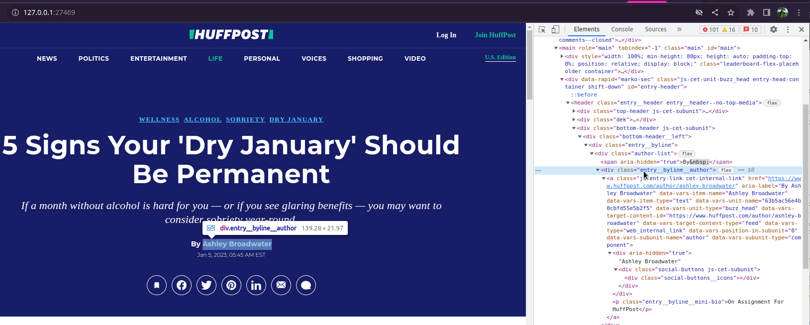

```{r, include = FALSE}
knitr::opts_chunk$set(
  collapse = TRUE,
  comment = "#>",
  eval = FALSE
)
```

This vignette shows you how to write your own parser for a new site.
Feel free to either use your parser locally or (preferably) contribute it back to the package via a [pull request](https://github.com/JBGruber/paperboy/pulls).

Before starting, check if the parser you need is already available with `pb_available()`, or if someone has already committed to working on it in [an issue](https://github.com/JBGruber/paperboy/issues).
If not, [open a new issue](https://github.com/JBGruber/paperboy/issues/new) to let others know you want to do it.

## Starting a New Parser

The entry point is `use_new_parser()`, which guides you through each step.
Just pass a URL from the target site and your GitHub author info:

```{r}
library(paperboy)
use_new_parser(
  x = "https://www.denverpost.com/2025/06/13/example/",
  author = "[@yourname](https://github.com/yourname/)",
  rss = "https://denverpost.com/feed" # optional; auto-detected if omitted
)
```

`use_new_parser()` is designed to be run multiple times:

- **First run** — creates the parser file from the template and opens it for editing, then exits.
- **Subsequent runs** — sources the edited file, tests it against live articles from the RSS feed, and updates `inst/status.csv` on success.

If `rss` is omitted in `use_new_parser`, the function below runs automatically and tries to identify an RSS feed.
This is used for testing the parser and is an important part of the infrastructure.
You can run it on its own if you need more control:

```{r}
pb_find_rss("https://www.denverpost.com")
```

If this does not retrieve and URLs, you might try a web search like "Denver Post RSS".

## Getting Test Data

The fastest way to get test articles is directly from the RSS feed:

```{r}
test_data <- pb_collect("https://denverpost.com/feed")
```

For broader coverage you can pull a larger set of URLs from the Media Cloud API (requires `MC_TOKEN` to be set):

```{r}
library(httr2)
test_data <- request("https://search.mediacloud.org/api/") %>%
  req_url_path_append("search/story-list") %>%
  req_headers(
    Authorization = paste("Token", Sys.getenv("MC_TOKEN")),
    Accept = "application/json"
  ) %>%
  req_url_query(
    q = "*",
    start = format(Sys.Date() - 7, "%Y-%m-%d"),
    ss = 107736L # source ID — look it up via the Media Cloud search UI
  ) %>%
  req_perform() %>%
  resp_body_json() %>%
  purrr::pluck("stories") %>%
  dplyr::bind_rows()
```

## Inspecting the HTML

Before writing selectors you need to see the raw HTML.
`paperboy` ships with `pb_inspect()`, which opens any collected page in your browser:

```{r}
pb_inspect(test_data, 1L)
```



Right-click the elements you care about and choose *Inspect* in your browser to see the CSS classes and attributes.
To get better with CSS selectors I recommend the game [CSS Diner](https://flukeout.github.io/).

## Writing the Parser

The template created by `use_new_parser()` looks like this:

```{r}
pb_deliver_paper.www_denverpost_com <- function(x, verbose = NULL, pb, ...) {
  pb_tick(x, verbose, pb)
  html <- rvest::read_html(x$content_raw)

  datetime <- html %>%
    rvest::html_element("") %>%
    rvest::html_attr("") %>%
    lubridate::as_datetime()

  headline <- html %>%
    rvest::html_element("") %>%
    rvest::html_attr("")

  author <- html %>%
    rvest::html_element("") %>%
    rvest::html_text2() %>%
    toString()

  text <- html %>%
    rvest::html_elements("") %>%
    rvest::html_text2() %>%
    paste(collapse = "\n")

  s_n_list(datetime, author, headline, text)
}
```

Fill in the empty strings with the CSS selectors and attributes you identified.
If you are familiar with `rvest`, this usually takes only a few minutes.
Feel free to look at the [existing parsers](https://github.com/JBGruber/paperboy/tree/main/R) for inspiration.
Some of them contains tricks that get around strange HTML structures or apply shortcuts that get clean data faster.

## Choosing CSS Selectors

### `html_search()` for robust fallbacks

The helper `html_search()` tries a list of selectors in order and returns the first non-empty result.
This is useful when a site uses different templates for different article types.
For example, the headline could live in different places depending on article type:

```{r}
headline <- html %>%
  html_search(
    selectors = c(
      "[property=\"og:title\"]",
      ".headline__title",
      ".headline",
      "title"
    ),
    attributes = c("content", "text")
  )
```

Set `all = FALSE` (the default) to return only the first non-empty match.
For multi-value fields like article paragraphs, set `n = Inf` to collect all nodes:

```{r}
text <- html %>%
  html_search(
    selectors = c(".article-body>p", "p"),
    attributes = "text",
    all = FALSE,
    n = Inf
  ) %>%
  paste(collapse = "\n")
```

### Targeting the article body

Prefer a specific container selector over bare `p` to avoid picking up ads, reader comments, and subscriber notices:

```{r}
# Too broad — catches everything on the page
text <- html %>%
  rvest::html_elements("p") %>%
  rvest::html_text2() %>%
  paste(collapse = "\n")

# Better — only paragraphs inside the article body class
text <- html %>%
  rvest::html_elements(".article-body>p") %>%
  rvest::html_text2() %>%
  paste(collapse = "\n")
```

There is always a trade-off: a specific selector gives cleaner text but may miss articles that use a different template; `html_search()` with a fallback chain gives you both.

### `s_n_list()` for safe returns

All parsers return a named list via `s_n_list()`, which ensures every element has length 1 and turns `NULL` values into `NA`:

```{r eval=TRUE}
a <- 1:10 # longer objects are stored in a list column
b <- NULL # NULL becomes NA
c <- NA
paperboy:::s_n_list(a, b, c)
```

You can include extra fields beyond the four required ones (`datetime`, `author`, `headline`, `text`); they are moved to the `misc` column automatically.

## Testing

After editing the parser, pass your collected test data to `use_new_parser()` — it will source the file, run `pb_deliver()` across all collected articles, and report failure rates for each required field:

```{r}
use_new_parser(
  x = "https://www.denverpost.com/2025/06/13/example/",
  author = "[@yourname](https://github.com/yourname/)",
  rss = "https://denverpost.com/feed",
  test_data = test_data
)
```

A field must parse successfully for ≥ 95 % of articles to pass.
If the parser fails, `use_new_parser()` offers to load `test_data` and the parsed results into your global environment so you can inspect which articles failed and why.

Once the parser passes, `use_new_parser()` updates `inst/status.csv` with a gold badge.
Open a pull request and you are done.

## Automated Testing

Every parser in the package is tested daily against its RSS feed in a [separate repository](https://sina-chen.github.io/paperboy-pulse/).
Results are visible on the [Dashboard](https://jbgruber.github.io/paperboy/articles/dashboard.html).
The RSS URL used for daily testing comes from the `rss` column in `inst/status.csv`, which `use_new_parser()` populates automatically.

## Contributing via LLM

LLM agents (such as Claude Code) can contribute parsers using the same workflow described above.
The main difference is that instead of `pb_inspect()`, the agent reads the raw HTML directly or calls `pb_html_context()` to get a compact text summary of the page structure — meta tags, unique element/class combinations, `<time>` elements, paragraph container paths, and JSON-LD blocks — without needing a browser.

If you are using Claude Code inside the `paperboy` repository, the `/new-parser` custom command automates the full workflow:

```
/new-parser https://www.denverpost.com/2025/06/13/example/
```

This runs each step — RSS discovery, data collection, HTML analysis, parser writing, iterative testing, and `status.csv` update — and creates a local commit ready for your review before you push.
